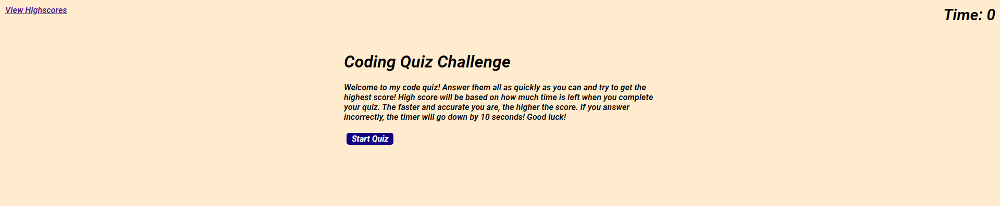
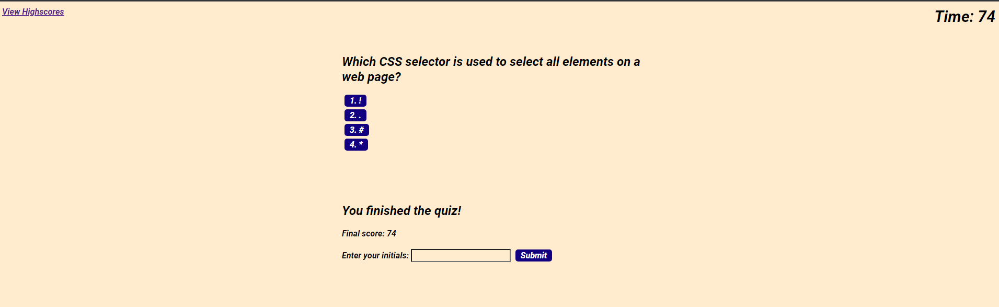

# code-quiz

## Description

The goal of this project is to create a quiz that helps users test their knowledge over certain languages such as HTML, CSS, and Javascript. To build a successful project, the quiz must be timed and has JavaScript fundamentals alongside with HTML and CSS. 

Using Javascript, it helps provide features for your HTML and CSS to be more responsive, as well as, clean and polished as it adapts to different elements on screen. This provides students build on their JavaScript fundamentals while assessing their knowledge about the subject and gauge their progress among their peers with this quiz.

## Usage

[Click here to view the project on GitHub pages.](https://github.com/jxdang1/code-quiz) Within the page, read the instruction first and click "Start Quiz" to begin the quiz. 

Here is some screenshots of what the deployed page will look like in subquential order:

Start screen of website:

Final score after taking quiz:

High score screen of where you can enter your initials:

## Credits

N/A

## License

Please see the license in the GitHub repo.